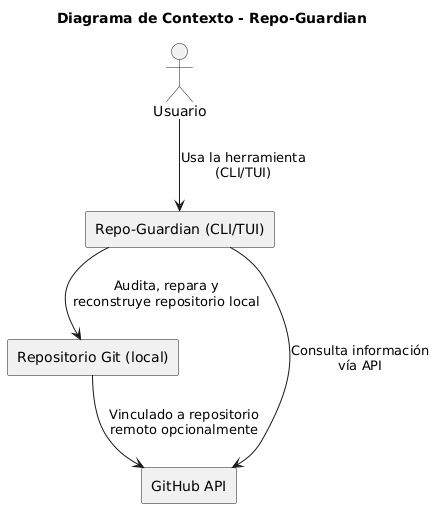

# Motivación
El proyecto Repo-Guardian nace como una respuesta técnica y didáctica ante los retos reales que enfrentan desarrolladores y equipos cuando una base de código versionada con Git se corrompe, pierde coherencia histórica o es manipulada de forma no trazable (rebase forzados, reescritura de historial, entre otros).

En el contexto de un curso avanzado de desarrollo de software, esta utilidad de línea de comandos (CLI) y con interfaz TUI (terminal user interface) tiene un propósito dual:

1. Formativo: Aplicar buenas prácticas DevOps y principios de desarrollo guiado por comportamiento (BDD), incluyendo la automatización CI/CD, pruebas con alta cobertura, documentación continua y control de versiones semántico.

2. Práctico: Ofrecer una herramienta robusta y extensible capaz de:

    - Verificar la integridad criptográfica de un repositorio Git usando árboles de Merkle.

    - Detectar y localizar commits defectuosos mediante heurísticas y git bisect.

    - Reconstruir historiales alterados basándose en métricas de similitud textual como la distancia de Jaro–Winkler.

    - Exportar el grafo de commits como un DAG para su análisis externo.

    - Guiar al usuario con una interfaz interactiva que permita diagnosticar y reparar problemas directamente desde la terminal.

**Repo-Guardian** busca ser más que un proyecto evaluativo: aspira a ser un ejercicio completo de ingeniería de software, integrando diseño limpio, automatización, trazabilidad y resiliencia técnica, todo respaldado por una cultura profesional de trabajo en equipo y calidad continua.

# Diagrama de contexto

##### git commit -m "RX-[NUMBER] [BRANCH]: TITULO" -m "DESCRIPCION #NUMBER"
# hola